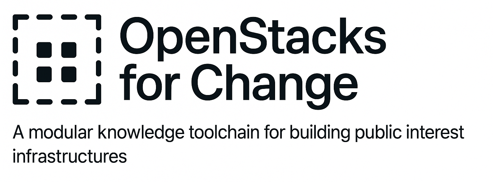

<p align="center">
  
</p>

<h1 align="center">OpenStacks for Change</h1>

<p align="center">
  <strong>Open-source tools for development research, evaluation, and program design.</strong><br>
  Built in India. Shared for impact.
</p>

<p align="center">
  <a href="https://openstacks.dev"></a>
  <a href="LICENSE"></a>
  <a href="https://buymeacoffee.com/varnasr"></a>
</p>

---

## The Problem

Across public health, climate adaptation, education, and gender equity, development organisations face the same challenge: they repeatedly build the same tools from scratch. Survey analysis scripts, MEL frameworks, policy trackers, data cleaning pipelines — each organisation creates its own, often in isolation, often losing institutional knowledge when projects end.

**OpenStacks for Change** is a response to that waste. It's an ecosystem of open, modular toolkits — each focused on a specific capability — that development practitioners can pick up, adapt, and build on.

## How It Works

The ecosystem is organised into **stacks** — self-contained repositories, each focused on a specific domain or capability. They share common conventions (sample data, documentation, reproducible scripts) but work independently. Use one stack or several. Adapt them to your context.

```
openstacks.dev                          ← You are here (hub + landing page)
│
├── InsightStack ···· MEL tools, calculators, visual frameworks
├── FieldStack ······ R notebooks for fieldwork and evaluation
├── EquityStack ····· Python/Jupyter data workflows
├── SignalStack ····· Research Rundown newsletter archive
│
├── RootStack ······· Database schemas and seed data
├── BridgeStack ····· FastAPI backend / API layer
├── ViewStack ······· Frontend UI and dashboards
└── PolicyStack ····· South Asia policy tracker
```

This repository is the coordinating hub. It hosts the [openstacks.dev](https://openstacks.dev) landing page, governance documents, and ecosystem-level documentation.

---

## The Stacks

### Active Stacks

These are mature, usable tools with real code, sample data, and documentation.

#### [InsightStack](https://github.com/Varnasr/InsightStack) — MEL Tools and Research Frameworks

The backbone of the ecosystem. Monitoring, evaluation, and learning (MEL) tools including calculators, visual frameworks, and research documentation templates. Includes a full **econometrics module** (DiD, PSM, IV/2SLS, RDD, sensitivity analysis) in Python and R, plus Observable notebooks, Excalidraw diagrams, Miro templates, and Flourish charts.

**Languages:** Stata, Python, R, Observable | **DOI:** 10.5281/zenodo.15245182

#### [FieldStack](https://github.com/Varnasr/FieldStack) — Applied Research and Evaluation

Reusable R notebooks and scripts for the full lifecycle of applied fieldwork: survey design, sampling, regression analysis, cost-effectiveness, qualitative coding, and automated reporting. Includes **survey tools** (sample size, weights, complex survey analysis) and **automated reporting** (batch Quarto rendering, monthly summary templates). Designed for researchers working with KoboToolbox, ODK, and Quarto.

**Languages:** R, Quarto, Stata

#### [EquityStack](https://github.com/Varnasr/EquityStack) — Development Data Workflows

Python scripts and Jupyter notebooks for data workflows across health, gender, education, and climate equity. Includes an **impact evaluation module** (DiD, PSM, RDD) and a **data cleaning pipeline** with automatic logging. Plug-and-play templates for modelling and visualisation that work with the data formats development practitioners actually use.

**Languages:** Python, Jupyter, Pandas

#### [SignalStack](https://github.com/Varnasr/SignalStack) — Research Rundown Newsletter

Companion repository for the [Research Rundown](https://researchrundown.substack.com) newsletter. Archived issues, featured research tools, method spotlights, and curated resources for staying current in development research.

**Format:** Markdown, Substack

#### [RootStack](https://github.com/Varnasr/RootStack) — Data Layer

Foundational database schemas, seed data, and queries for the ecosystem's data layer. PostgreSQL and SQLite. The shared data backbone that other stacks connect to.

#### [BridgeStack](https://github.com/Varnasr/BridgeStack) — API Backend

FastAPI backend that bridges RootStack data to frontend applications via REST API. The plumbing that connects data to dashboards and tools.

#### [ViewStack](https://github.com/Varnasr/ViewStack) — Frontend and Visualisation

React frontend for visualising OpenStacks data. State and scheme dashboards, indicator explorer with interactive charts, and budget trend analysis. Built with React, Recharts, and Vite.

#### [PolicyStack](https://github.com/Varnasr/PolicyStack) — Policy Tracker

South Asia policy tracker with 15 flagship government schemes, 4 years of budget data, performance indicators, and analysis scripts. Turning policy documents into structured, queryable data.

---

### On the Roadmap

Future stacks being designed:

| Stack | Focus |
|-------|-------|
| **ClimateStack** | Composite risk scores, resilience modelling, geo-spatial mapping |
| **EduStack** | Learning assessment pipelines, education outcome dashboards |
| **SocialStack** | Rapid ethnography, qualitative coding, NLP for field narratives |
| **InfraStack** | Access scoring, infrastructure mapping, spatial planning tools |

---

## Who This Is For

**Development practitioners** working across health, education, gender equity, climate, and governance — primarily in India and South Asia — who need analysis tools they can actually use, not just read about.

This includes:

- **Evaluators and researchers** doing MEL, impact assessment, and policy analysis
- **Data analysts** in NGOs, government agencies, and multilateral organisations
- **Programme designers** building theories of change, log frames, and M&E systems
- **Students and educators** in development economics and public policy
- **Anyone** building open tools for social impact

## Getting Started

1. **Find your stack** — Browse the list above and pick the one that matches your language (R, Python, Stata) and domain
2. **Clone it** — Each stack is self-contained with its own README, sample data, and documentation
3. **Adapt it** — Scripts and templates are designed to be modified for your specific data, programmes, and context
4. **Contribute back** — Found a bug? Built a useful extension? Share it with the community via a pull request

## Contributing

Contributions are welcome across all stacks. See the [Contributing Guidelines](CONTRIBUTING.md) for how to submit tools, scripts, templates, and documentation.

The ecosystem follows a [Code of Conduct](CODE_OF_CONDUCT.md) grounded in the values of public interest work.

## Citation

If you use OpenStacks in your work, please cite it. See [CITATION.cff](CITATION.cff) for machine-readable citation metadata.

## About

**Dr. Varna Sri Raman** — Development economist and social researcher with 20+ years of experience across public health, education, gender equity, and climate resilience in India and South Asia. Has led programme design, MEL strategies, and research with Oxfam, UNICEF, Gates Foundation, PLAN India, and BBC Media Action.

[GitHub](https://github.com/Varnasr) | [Twitter](https://x.com/varna) | [Web](https://on-web.link/varna)

## Support

If OpenStacks is useful to your work, consider supporting the project:

- [Buy Me a Coffee](https://buymeacoffee.com/varnasr)
- UPI: `varna@icici`

## License

MIT — free to use, modify, and share. See [LICENSE](LICENSE).

---

<sub>AI tools (ChatGPT, Claude) have been used for documentation, code generation, and editing support. All decisions, designs, datasets, and content curation are entirely the creator's.</sub>
