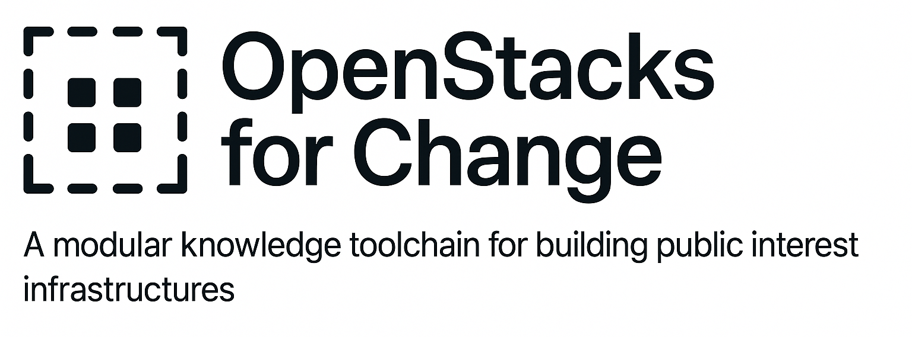

  

<h1 align="center">OpenStacks for Change</h1>

  <strong>An index of open-source work on development research, data, and policy.</strong> 
  Built in India. Shared for impact.

  
  
  

---

## What this is

This repository is an **index**, not a product. It hosts [openstacks.dev](https://openstacks.dev) and points to the open-source repositories behind my work in development economics, evaluation, and public-interest data.

It began in 2025 as the hub for a family of eight interlocking "stacks." Some of those are still genuinely useful and still here. Others were scaffolding for an ecosystem that never needed to exist, and they have been retired. The sections below say plainly which is which.

If you are looking for the polished, reader-facing version of this work, start with the platforms — not this repo.

## Start here

| | | |
|---|---|---|
| **[Impact Mojo](https://www.impactmojo.in)** | Teaching and practice platform for development economics and social research. | [repo](https://github.com/ImpactMojo/ImpactMojo) |
| **[JanVayu](https://www.janvayu.in)** | जनवायु — a citizen-led national archive of India's air quality crisis. | [repo](https://github.com/JanVayu/JanVayu) |
| **[openstacks.dev](https://openstacks.dev)** | This index — the code behind the above, plus the research toolkits. | you are here |

---

## Projects

### Data and policy

| Project | What it is |
|---|---|
| **[PolicyDhara](https://github.com/Varnasr/PolicyDhara)** | Auto-updating tracker of Indian government policy across development sectors. A complement to Impact Mojo. |
| **[How India Lives](https://howindialives.impactmojo.in)** | 205 state-level choropleth maps and 10 visual stories on India's diversity across demography, health, gender, economy, education, and environment. [Source](https://github.com/Varnasr/how-india-lives). |
| **[Some Perspective](https://github.com/Varnasr/someperspective)** | Unfunded empirical study of India's political economy, 2004–2026. Three constructed indices, full dataset, replication code, and a working paper. |
| **[H-VSAINC](https://github.com/Varnasr/H-VSAINC)** | Hyderabad voting patterns and public infrastructure, 1999–2023, across five assembly seats. |
| **[Bihar Parichay](https://github.com/Varnasr/BiharParichay-Project)** | Interactive bilingual resource on Bihar — society, economy, caste, migration, climate, culture. Single offline-capable HTML file. |
| **[SDG Progress Tracker](https://sdgtracker.impactmojo.in)** | India's progress on all 17 UN Sustainable Development Goals — scores, trends, radar charts, and category breakdowns. |
| **[India Development Indicators](https://devindicators.impactmojo.in)** | Interactive dashboard across economic, health, education, infrastructure, and environmental indicators, pulling live from the World Bank Open Data API. |
| **[Climate TRACE India](https://climatetrace.impactmojo.in)** | Satellite-verified, facility-level greenhouse-gas emissions for India — power, manufacturing, transport, fossil fuels, agriculture, and waste, including the top-emitting coal and steel plants. |
| **[Industry Conglomerates Tracker](https://industrygroups.impactmojo.in)** | Open geographic database of 444 major Adani and Ambani infrastructure projects, 1999–2026 — searchable and filterable, with government-support classification. |
| **[WhoGaveTheOrder.in](https://whogavetheorder.netlify.app)** | Citizen-led accountability archive asking who authorised the use of state power against citizens. A six-state evidence grammar, a chain-of-command map, and an RTI register with a live reply-due clock. |

### Teaching and practice

| Project | What it is |
|---|---|
| **[Dev Case Studies](https://github.com/Varnasr/dev-case-studies)** | 200 real development case studies from 117 countries — searchable, filterable, fully cited. |
| **[Development Discourses](https://github.com/Varnasr/development-discourses)** | Curated open-access library of 500+ papers, books, and grey literature for South Asian practitioners. |
| **[DevData Practice](https://github.com/Varnasr/devdata-practice)** | Realistic practice datasets — 10 generators, 350k+ rows. |
| **[DevEconomics Toolkit](https://github.com/Varnasr/deveconomics-toolkit)** | 11 interactive Shiny apps for impact evaluation, poverty analysis, and program design. |
| **[The Real Middle](https://github.com/Varnasr/The-Real-Middle)** | Interactive game revealing where you actually stand in India's income distribution. |
| **[ImpactLex](https://www.impactmojo.in/impactlex/)** | Development-sector glossary and companion to Impact Mojo — 390+ terms merged from 20 course lexicons, with 5 case studies, 10 worked formulae, and cross-references to where each term is taught. Offline-capable PWA. |

### Research toolkits — the OpenStacks

Reusable scripts, notebooks, and templates for people doing MEL and applied research. These are **stable**: usable today, maintained on a low-touch basis, not under active development. See [MAINTENANCE.md](MAINTENANCE.md).

| Stack | What it is | Languages |
|---|---|---|
| **[InsightStack](https://github.com/Varnasr/InsightStack)** | The largest of the set. MEL calculators, visual frameworks, research documentation templates, and a full econometrics module (DiD, PSM, IV/2SLS, RDD, sensitivity analysis). | Stata, Python, R, Observable |
| **[FieldStack](https://github.com/Varnasr/FieldStack)** | Applied fieldwork lifecycle — survey design, sample size, sampling weights, complex survey analysis, cost-effectiveness, qualitative coding, batch Quarto reporting. | R, Quarto, Stata |
| **[EquityStack](https://github.com/Varnasr/EquityStack)** | Development data workflows across health, gender, education, and climate equity. Impact evaluation module and a logged data-cleaning pipeline. | Python, Jupyter |
| **[PolicyStack](https://github.com/Varnasr/PolicyStack)** | South Asia policy tracker — 15 flagship schemes, 4 years of budget data, performance indicators. Superseded for new work by [PolicyDhara](https://github.com/Varnasr/PolicyDhara). | Python, CSV |
| **[SignalStack](https://github.com/Varnasr/SignalStack)** | Companion archive for the [Research Rundown](https://researchrundown.substack.com) newsletter — issues, featured tools, method spotlights. | Markdown |

InsightStack has a DOI: [10.5281/zenodo.15245182](https://doi.org/10.5281/zenodo.15245182).

### Prototypes and research outputs

Early-stage work, built in the [Experiments](https://github.com/Varnasr/Experiments) sandbox. Expect rough edges — these are shared because they are useful, not because they are finished.

| Project | What it is |
|---|---|
| **[Court Petition Translator](https://github.com/Varnasr/Experiments/tree/main/court-translator)** | Hindi → English translation for Supreme Court and High Court petitions. Sarvam AI handles translation; Llama 3.3 corrects legal terminology (याचिकाकर्ता → Petitioner, अनुच्छेद → Article). Prototype. |

### Writing

| Project | What it is |
|---|---|
| **[The Measurement Trap](https://github.com/Varnasr/the-measurement-trap)** | Companion site for *The Measurement Trap: India's Quest for Social Progress Through Eight Decades* (Routledge, forthcoming). Live at [whatcounts.in](https://whatcounts.in/). |
| **[The Very Last Superhero](https://github.com/Varnasr/theverylastsuperhero)** | Illustrated speculative fiction set in a climate-collapsed India. |

### Utilities

| Project | What it is |
|---|---|
| **[CandidateDossier](https://github.com/Varnasr/CandidateDossier)** | CSV → LaTeX → PDF generator for uniform, privacy-masked candidate dossiers. |
| **[Experiments](https://github.com/Varnasr/Experiments)** | The sandbox the projects above are built in, plus smaller tools. Where ideas live before they graduate to their own repository — or get quietly retired. |
| **[.github](https://github.com/Varnasr/.github)** | Shared community health files — contributing guide, code of conduct, issue templates — inherited by every repo above. |

---

## Retired

These are archived and read-only. The code stays public and browsable; nothing has been deleted. They were built as a database → API → dashboard pipeline for an ecosystem that the toolkits above never actually needed.

| Repo | Was |
|---|---|
| **[RootStack](https://github.com/Varnasr/RootStack)** | SQLite/PostgreSQL schemas and seed data for the shared data layer |
| **[BridgeStack](https://github.com/Varnasr/BridgeStack)** | FastAPI backend serving RootStack to frontends |
| **[ViewStack](https://github.com/Varnasr/ViewStack)** | React dashboard for exploring the data |
**Not retired — graduated.** [ImpactLex](https://www.impactmojo.in/impactlex/) moved into Impact Mojo rather than winding down, and is listed under Teaching and practice above. Its [old repository](https://github.com/Varnasr/ImpactLex) is archived for citation continuity only; the living version is at [impactmojo.in/impactlex](https://www.impactmojo.in/impactlex/).

Four further stacks — ClimateStack, EduStack, SocialStack, InfraStack — were on a published roadmap and were never started. That roadmap has been withdrawn rather than left standing as a promise. The needs behind them are better served by [How India Lives](https://github.com/Varnasr/how-india-lives), [PolicyDhara](https://github.com/Varnasr/PolicyDhara), and [JanVayu](https://www.janvayu.in).

---

## Status vocabulary

Every repo listed here uses one of three labels, and they mean specific things:

| Label | Meaning |
|---|---|
| **Active** | Under current development. Issues and pull requests get responses. |
| **Stable** | Usable and correct, not under development. Bug reports are welcome; new features are unlikely. |
| **Retired** | Archived, read-only. Kept public for reference and citation. |

The full policy — what gets updated, how often, and what to expect if you open an issue — is in [MAINTENANCE.md](MAINTENANCE.md).

## Using this work

Everything here is MIT-licensed code unless a repo says otherwise (some carry Creative Commons terms for written content — check the individual LICENSE). You can clone, adapt, and redistribute. Attribution is appreciated, not required.

Each toolkit is self-contained: clone the one you need, read its README, run it. There is no ecosystem to install and no shared dependency to satisfy.

## Contributing

Issues and pull requests are welcome on any repo marked Active or Stable. Shared guidelines live in the [.github repo](https://github.com/Varnasr/.github):

- [Contributing guidelines](https://github.com/Varnasr/.github/blob/main/CONTRIBUTING.md)
- [Code of Conduct](https://github.com/Varnasr/.github/blob/main/CODE_OF_CONDUCT.md)

Please be aware that response times on Stable repos are measured in weeks, not days.

## Citation

If you use this work, please cite it. Machine-readable metadata is in [CITATION.cff](CITATION.cff).

## About

**Dr. Varna Sri Raman** — Development economist and social researcher with 20+ years of experience across public health, education, gender equity, and climate resilience in India and South Asia. Has led programme design, MEL strategies, and research with Oxfam, UNICEF, Gates Foundation, PLAN India, and BBC Media Action.

[GitHub](https://github.com/Varnasr) · [Twitter](https://x.com/varna) · [Web](https://on-web.link/varna)

## Support

If this work is useful to you, you can support it via UPI: `varna@icici` — see [support.html](https://openstacks.dev/support.html) for a QR code.

## License

MIT — free to use, modify, and share. See [LICENSE](LICENSE).

---

AI tools have been used for documentation, code generation, and editing support. All decisions, designs, datasets, and content curation are entirely the creator's.
