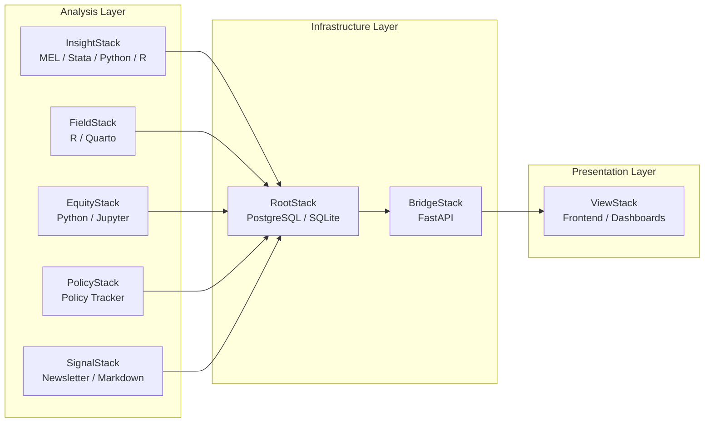

# Architecture

How the OpenStacks ecosystem fits together.

---

## Overview

OpenStacks is a collection of independent, modular stacks. Each stack handles a specific domain or capability. They can be used alone or wired together through shared conventions and a common data pipeline.

The key design idea: **analysis stacks produce insights, infrastructure stacks move and serve them, and the frontend stack makes them accessible.**

## Data Flow

```
Analysis Layer              Infrastructure Layer         Presentation Layer
┌─────────────┐
│ InsightStack │──┐
│ FieldStack   │──┤
│ EquityStack  │──┼──→  RootStack  ──→  BridgeStack  ──→  ViewStack
│ PolicyStack  │──┤     (database)      (API)             (frontend)
│ SignalStack  │──┘
└─────────────┘
```

1. **Analysis stacks** (InsightStack, FieldStack, EquityStack) produce cleaned datasets, indicators, and research outputs.
2. **RootStack** stores structured data in PostgreSQL/SQLite — the shared data backbone.
3. **BridgeStack** exposes that data via FastAPI REST endpoints.
4. **ViewStack** renders interactive dashboards and data stories in the browser.
5. **PolicyStack** and **SignalStack** feed curated content into the same pipeline or operate independently.

### Mermaid Diagram



## Design Principles

### Independence first
Every stack works on its own. You should never need to set up the full ecosystem to use a single stack. Clone one repo, follow its README, and go.

### Shared conventions, not shared code
Stacks don't import from each other. They align through conventions: consistent directory structures, sample data formats (CSV by default), and documentation patterns. This keeps coupling low and adoption easy.

### Practitioner-facing
These tools are built for people doing development work — evaluators, analysts, programme designers. Not for platform engineers. That means: readable scripts, real sample data, clear documentation, and sensible defaults.

### Reproducibility
Every analysis should be reproducible. Scripts include sample data. Notebooks are self-contained. Dependencies are documented. If someone clones a stack six months from now, it should still run.

### Progressive complexity
Start simple. A single R notebook or Python script. If you need a database, add RootStack. If you need an API, add BridgeStack. The ecosystem scales with your needs — you don't pay for complexity you don't use.

## Stack Layers

| Layer | Stacks | Role |
|-------|--------|------|
| **Analysis** | InsightStack, FieldStack, EquityStack | Produce research outputs, cleaned data, indicators |
| **Content** | SignalStack, PolicyStack | Curate knowledge, track policy, publish narratives |
| **Data** | RootStack | Store and structure data centrally |
| **API** | BridgeStack | Serve data to applications via REST |
| **Frontend** | ViewStack | Visualise and interact with data |

## Technology Choices

| Stack | Primary Tech | Why |
|-------|-------------|-----|
| InsightStack | Stata, Python, R, Observable | Matches what development researchers already use |
| FieldStack | R, Quarto | Strong in survey analysis; Quarto for reproducible reports |
| EquityStack | Python, Jupyter, Pandas | Accessible; large ecosystem for data work |
| SignalStack | Markdown | Lightweight; integrates with Substack |
| RootStack | PostgreSQL, SQLite | PostgreSQL for production; SQLite for portability |
| BridgeStack | FastAPI | Fast, modern Python API framework with auto-generated docs |
| ViewStack | TBD | Frontend framework to be determined based on needs |
| PolicyStack | TBD | Structured data from policy documents |

## Directory Conventions

Each stack follows a consistent structure:

```
StackName/
├── README.md
├── LICENSE
├── sample_data/        ← Real or realistic sample datasets
├── scripts/            ← Analysis scripts, notebooks
├── docs/               ← Stack-specific documentation
└── tests/              ← Where applicable
```

Details on data standards are in [DATA_STANDARDS.md](DATA_STANDARDS.md).
